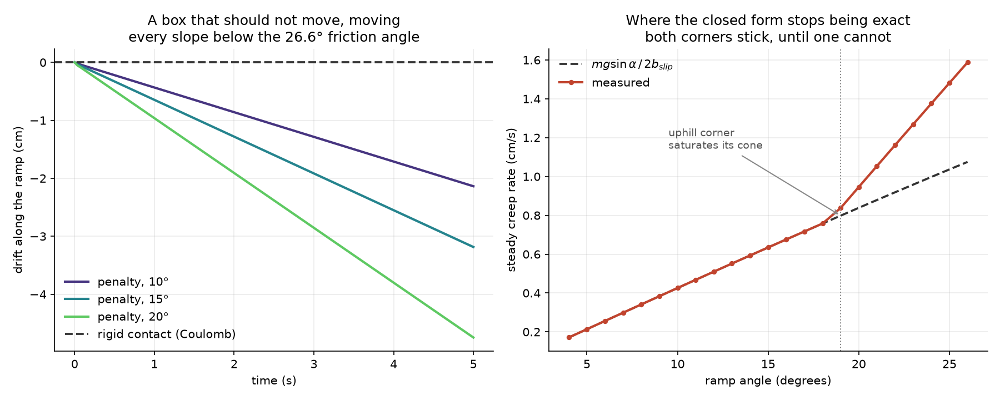

# slope-control

Control and reinforcement learning on top of [GRIP](https://github.com/Pesmart12/GRIP),
a 2D differentiable rigid-body contact simulator.

GRIP simulates and differentiates; it deliberately contains no policies,
rewards, or training loops. This is the other half of that split — the
repository that poses tasks and solves them.

## What it is for

Build an RL control stack on GRIP 1.0's penalty contact and measure what
it does. Then rebuild it on 2.0's NCP solve and measure again. Put the two
sets of numbers side by side and describe what changed.

The task is a box pushed up a ramp and held there, on a slope below the
friction angle — where rigid physics says a released box never moves.

GRIP 1.0 models contact as a penalty force — a stiff spring-damper with a
Coulomb friction cone. That formulation keeps the force constraint exact
and softens the kinematic one, so a box resting on a slope must be
*slipping* in order to generate the friction that holds it up. It creeps,
forever, at `mg·sinα / (2·b_slip)` — **4.7 cm in five seconds** on a 20°
ramp, about a sixth of a box width, on a slope where rigid physics says
it must not move at all.

GRIP 2.0 will replace that with a velocity-level NCP solve, where the
same box sticks exactly.



Measured, in [`experiments/drift.py`](experiments/drift.py). The right
panel is a second finding that fell out of checking the first: the closed
form is exact to five figures below about 19°, and a lower bound above it,
because friction's moment arm tilts the box enough to redistribute normal
force between the corners until the lightly loaded one saturates on its
cone.

That is the physics half, and it needed no policy to produce. The other
half is what a learned controller does with it — whether one trained
against a phantom drag still behaves when the drag disappears. That is for
the measurements to answer, not for this README.

Full task definition, scene numbers, reward and what gets measured:
[`docs/ramp_manipulation_task.md`](docs/ramp_manipulation_task.md).

## Approach

| | |
|---|---|
| Task | push a box up a ramp to a target and hold it |
| Zeroth-order | MPPI / CEM — a planner, not a learner. Confirms the task is solvable and shows what good looks like. |
| First-order | SHAC, consuming GRIP's analytic gradients through `adjoint_batch` |
| Scoring | NCP, whichever simulator a policy trained in — the more accurate of the two. |

PPO is skipped: it never touches the simulator's gradients, which are the
thing GRIP uniquely provides, and the sample budget at `dt = 5e-4` is
brutal.

The drift measurement stands on its own — a box on a slope below the
friction angle must not move, and that is Coulomb's law rather than a
modelling opinion. Everything after it is a build, and the comparison at
the end reports whatever the numbers turn out to say.

## Status

| | |
|---|---|
| Drift measurement | **done** — `experiments/drift.py`, the plot above |
| MPPI / CEM planner | not started |
| SHAC | not started |
| NCP half of every comparison | waiting on GRIP 2.0 |

The first milestone needed no policy and no training, which is why it came
first: place a box on a tilted half-plane, roll out five seconds of zero
controls, and measure. The other half of that plot is the same figure with
a solve in place of a spring.

## Setup

Needs GRIP installed. On a machine where the C++ toolchain is not on
`PATH`, import the build environment first:

```powershell
$vs = "C:\Program Files (x86)\Microsoft Visual Studio\18\BuildTools"
cmd /c "`"$vs\VC\Auxiliary\Build\vcvars64.bat`" && set" |
  Where-Object { $_ -match '^(PATH|INCLUDE|LIB|LIBPATH)=' } |
  ForEach-Object { $n, $v = $_ -split '=', 2; Set-Item -Path "env:$n" -Value $v }
$env:PATH = "$vs\Common7\IDE\CommonExtensions\Microsoft\CMake\CMake\bin;" +
            "$vs\Common7\IDE\CommonExtensions\Microsoft\CMake\Ninja;$env:PATH"

pip install -e ..\GRIP
```

An editable install of GRIP does **not** rebuild on C++ changes — reinstall
after touching its `src/`.

## Layout

```
slope_control/   the ramp scene, shared by every experiment
experiments/     one script per artifact, each runnable on its own
figures/         their output, committed so the results are visible here
docs/            task definition and experiment design
```

Policies, planners and training loops will join `slope_control/`. None of
it goes into GRIP — that repository holds physics and derivatives, and
this one holds everything that decides what to do with them.
