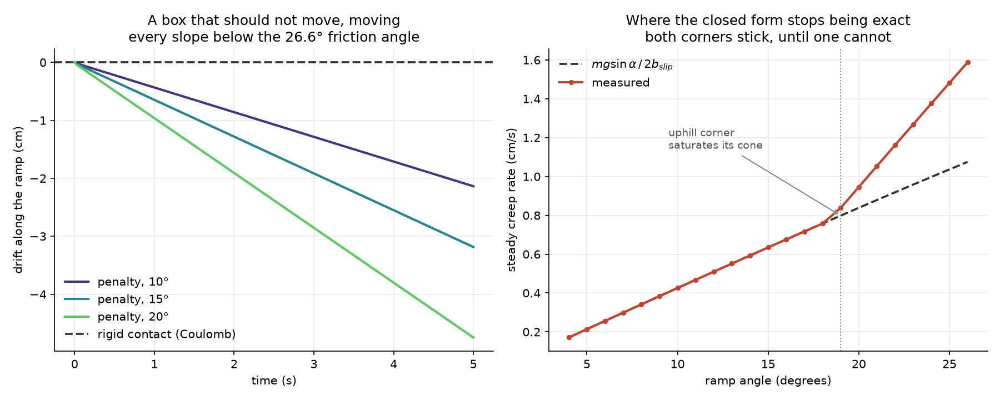
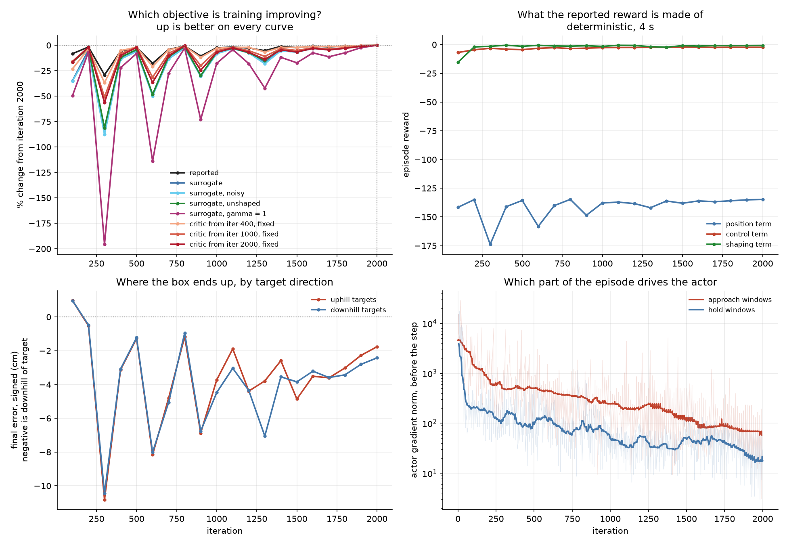

# slope-control

Control and reinforcement learning on top of [GRIP](https://github.com/Pesmart12/GRIP),
a 2D differentiable rigid-body contact simulator.

GRIP simulates and differentiates; it deliberately contains no policies,
rewards, or training loops. This is the other half of that split — the
repository that poses tasks and solves them.

## What it is for

Build a reinforcement-learning controller on GRIP 1.0's penalty contact
and measure what it does. Then rebuild it on 2.0's NCP solve, measure
again, and put the two sets of numbers side by side.

The task: two pushers move an unactuated box up or down a ramp to a
target and hold it there, on a slope below the friction angle. The full
definition — scene numbers, reward, episode structure — is in
[`docs/ramp_manipulation_task.md`](docs/ramp_manipulation_task.md).

## The physics: penalty contact creeps

GRIP 1.0 models contact as a penalty force — a stiff spring-damper with a
Coulomb friction cone. That keeps the force constraint exact and softens
the kinematic one, so a box resting on a slope must be *slipping* to
generate the friction that holds it up. It creeps, forever, at
`mg·sin α / (2·b_slip)` — **4.75 cm in five seconds** on a 20° ramp, where
rigid physics says it must not move at all. GRIP 2.0 replaces this with a
velocity-level NCP solve, where the same box sticks.



Measured in [`experiments/drift.py`](experiments/drift.py), with no
policy involved. The closed form is exact to five figures below about 19°
and a lower bound above it: friction's moment arm tilts the box enough to
shift normal force between its corners until the lighter one saturates
its cone.

## The controller: SHAC

SHAC trains the policy with GRIP's analytic gradients, differentiating
short windows of simulation through the contact via `adjoint_batch`. It
runs the reference implementation's configuration, NVlabs/DiffRL's, with
two recorded exceptions. PPO is skipped: it never uses the simulator's
gradients, which are the thing GRIP provides, and the sample budget at
`dt = 5e-4` is brutal.

**What the policy does.** It drives the box to its target and holds it
there, about 1 cm downhill of the target — 0.9 to 1.2 cm across two seeds
and both target directions — on 64 environments it was never selected
on. Training takes 2000 iterations, about 23 minutes on a CPU.

**What sets that 1 cm.** The reward trades position against holding
force, and a tolerance says where the two balance. At a 2 cm tolerance
the box parked 2–3.5 cm off; at 1 cm it parks about 1 cm off, using about
50% more force. Doubling the training to 4000 iterations did not move it.

**How it got there.** SHAC first ran on a configuration of its own, which
found a good policy by iteration 400 and then lost it. The cause was the
critic, which stopped tracking the policy. Moving to the reference
configuration fixed it.
[`experiments/diagnose_shac.py`](experiments/diagnose_shac.py) measures
both.



## Status

| | |
|---|---|
| Drift measurement | **done** — `experiments/drift.py` |
| Task, reward and gradient path | **done** — `tests/check_task.py`, `tests/check_policy_gradient.py` |
| Trajectory optimization check | **done** — `tests/check_trajopt.py`: the reward is solvable and its gradients navigable |
| SHAC | **done** — `experiments/train_shac.py`, `experiments/diagnose_shac.py` |
| Demo | **done** — `demo/index.html`, an interactive replay of the trained policy; `python experiments/demo.py` builds its data |
| NCP half | waits on GRIP 2.0 |

Training is unstable early — the hold collapses and recovers a few times
before settling — but it ends in the same place whichever seed runs.

## Setup

The project has been built on both Windows and Linux. The environment is
the same on either; only the step that compiles GRIP differs.

A conda environment, because PyTorch arrives that way and the CPU build
from conda-forge matches the Python the rest of the stack already uses.
`cmake` and `ninja` come from conda-forge as well, so the build needs
nothing installed system-wide. The two forms differ only in the
line-continuation character — PowerShell:

```powershell
conda create -n slope-control -c conda-forge --override-channels `
    python=3.13 numpy matplotlib "pytorch=*=cpu*" cmake ninja
```

and bash:

```bash
conda create -n slope-control -c conda-forge --override-channels \
    python=3.13 numpy matplotlib "pytorch=*=cpu*" cmake ninja
```

### Building GRIP — Windows

The MSVC toolchain has to be on `PATH` first, which `vcvars64.bat`
arranges. conda-forge supplies `cmake` and `ninja`, so only the compiler
itself comes from Visual Studio:

```powershell
$vs = "C:\Program Files (x86)\Microsoft Visual Studio\18\BuildTools"
cmd /c "`"$vs\VC\Auxiliary\Build\vcvars64.bat`" && set" |
  Where-Object { $_ -match '^(PATH|INCLUDE|LIB|LIBPATH)=' } |
  ForEach-Object { $n, $v = $_ -split '=', 2; Set-Item -Path "env:$n" -Value $v }

conda activate slope-control
pip install -e ..\GRIP
pip install -e . --no-deps
```

**Activate the environment; do not call its `python.exe` by path.** Conda
puts its own DLLs on `PATH` at activation, and matplotlib's PNG writer
delay-loads one of them. Without activation `savefig` dies with
`0xC06D007F` and *no Python traceback at all* — every other part of the
stack, GRIP included, keeps working, so it reads as a matplotlib bug
rather than a missing path.

### Building GRIP — Linux

The system compiler is enough, and nothing needs root:

```bash
conda activate slope-control
pip install -e ../GRIP
pip install -e . --no-deps
```

**GRIP's `grip_core` must be compiled with `POSITION_INDEPENDENT_CODE`.**
It is a static library linked into a shared Python module, and ELF linkers
reject non-PIC objects inside a shared object outright, so the bindings
fail to link with a `recompile with -fPIC` error. Set in GRIP's
`src/CMakeLists.txt`. Windows draws no such distinction, which is why this
only appeared on the first Linux build.

### Both platforms

`pip install -e . --no-deps` installs this package so `slope_control`
imports from anywhere rather than only from the repository root.
`--no-deps` because numpy, matplotlib and torch already came from conda
and pip should not pull wheels over them.

An editable install of GRIP does **not** rebuild on C++ changes — reinstall
after touching its `src/`.

`conda run -n slope-control python ...` is the safer form in scripts, and
is what `conda activate` replaces interactively.

Verify against numbers that are already recorded, rather than against
"it imported":

```
python tests/check_task.py              # 11/11
python tests/check_critic_targets.py    # 3/3
python experiments/drift.py             # 4.75 cm at 20 degrees
```

If those disagree with what is written here, the environment is wrong
and nothing measured in it is worth reading.

## Layout

```
slope_control/   the scene, the task, the policy and the training loop
experiments/     one script per artifact, each runnable on its own
figures/         their output, committed so the results are visible here
runs/            training logs, evaluation histories and checkpoints
tests/           the checks the build order rests on
docs/            task definition and experiment design
demo/            the interactive demo page; its data is built by experiments/demo.py
```

None of it goes into GRIP — that repository holds physics and derivatives,
and this one holds everything that decides what to do with them.
